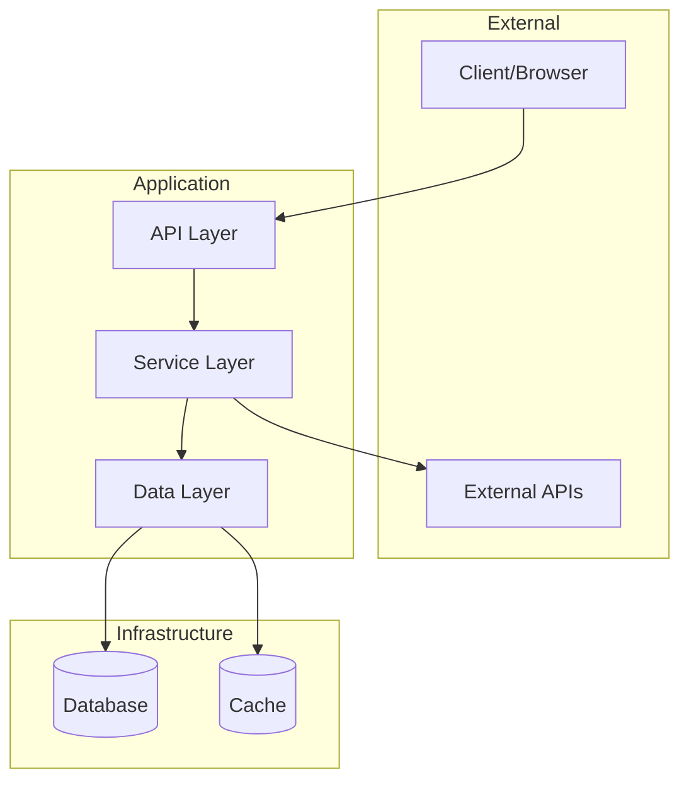
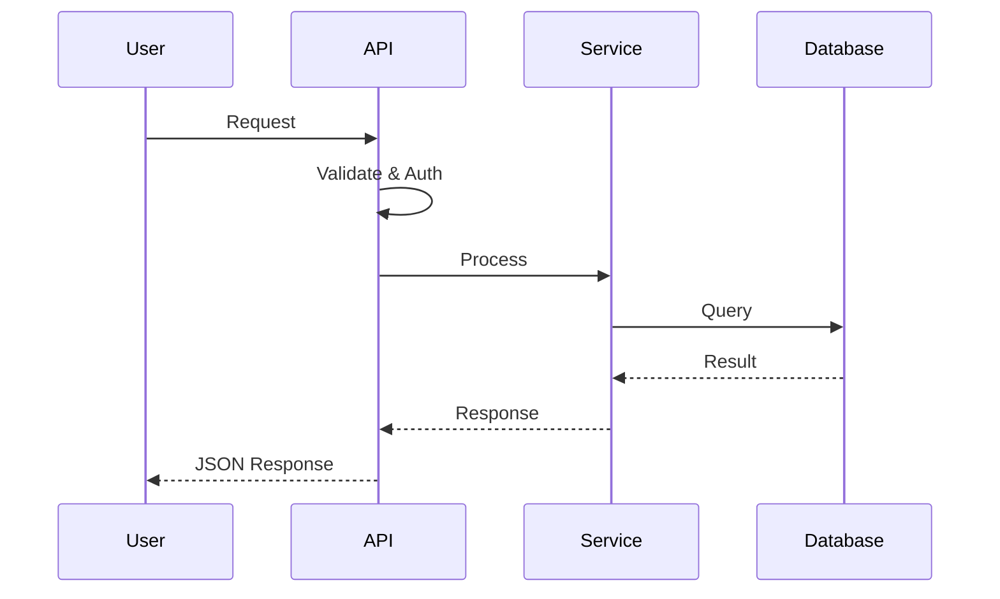
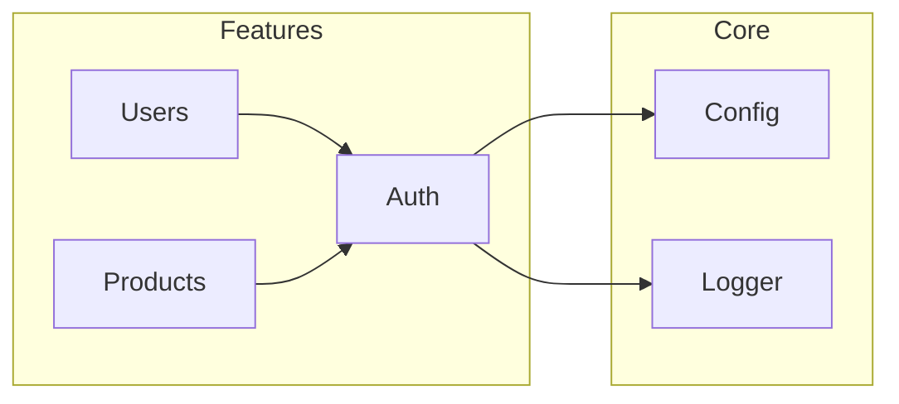

Increment this value every time you update this file: `77`

# AI Documentation Generation Plan

> A reusable, consistent template for generating software documentation using AI.

---

## Table of Contents

1. [Overview](#overview)
2. [Output Structure](#output-structure)
3. [Phase 1: Project Discovery](#phase-1-project-discovery)
4. [Phase 2: Source Structure Mapping](#phase-2-source-structure-mapping)
5. [Phase 3: Architecture Analysis](#phase-3-architecture-analysis)
6. [Phase 4: Diagram Generation](#phase-4-diagram-generation)
7. [Phase 5: Documentation Assembly](#phase-5-documentation-assembly)
8. [Document Templates](#document-templates)
9. [Quality Checklist](#quality-checklist)

---

## Overview

### Purpose

This plan provides AI agents with a systematic approach to generate consistent, high-quality documentation for TypeScript projects. The documentation should be:

- **Accurate** - Reflects the actual codebase state
- **Complete** - Covers all essential aspects
- **Understandable** - Written for humans, not machines
- **Navigable** - Easy to find information
- **Visual** - Includes diagrams where helpful
- **Actionable** - Enables users to get started quickly
- **Maintainable** - Structured for easy updates

### Scope

- **Primary language**: TypeScript
- **Package manager**: npm (via `package.json`)
- **Diagram format**: Mermaid
- **Output format**: Markdown
- **Output location**: `docs/` directory

### Note

This document is to be used as a guideline on creating documentation.

Some of the examples here may not be reasonable for different projects and different contexts.

Be smart and adapt reasonably with one goal in mind: Create good documentation.

---

## Output Structure

Example files in the `docs/` directory:

```
docs/
├── README.md                    # Main entry point & navigation
├── OVERVIEW.md                  # Human-friendly project explanation
├── GETTING_STARTED.md           # Prerequisites, setup, usage
├── ARCHITECTURE.md              # System design + Mermaid diagrams
├── EXTERNAL_DEPENDENCIES.md     # External software with versions
└── SOURCE_STRUCTURE.md          # Directory tree with file descriptions
```

Generate Mermaid diagrams if needed.

### Markdown Formatting Guidelines

**Directory Trees**: Use box-drawing characters `─│├└` when visualizing directory structures in code blocks.

**Bold Labels**: Use colon format for bold labels:

- ✅ `**Head**: Body.`
- ❌ `**Head** - body`

**File Paths**: Wrap all file paths in backticks: `` `src/index.ts` ``

**Technology Names**: In tables, wrap package/technology names in backticks: `` `Node.js` ``, `` `TypeScript` ``

## Phase 1: Project Discovery

### Objective

Gather foundational project information by scanning configuration files and project metadata.

### Files to Scan

Scan all configuration files, dotfiles, and metadata in the project root. Common files include:

- `README.md`
- `package.json`
- `package-lock.json`
- `tsconfig.json`
- `tsconfig.*.json`
- `turbo.json`
- `.turbo/`
- `.npmignore`
- `.prettierignore`
- `.prettierrc`
- `npmignore`
- `npm-shrinkwrap`
- `.dockerignore`
- `.eslintignore`
- `.eslintrc`
- `.jestrc`
- `.gitignore`
- `.gitattributes`
- `.gitlab-ci`
- `.env.example`
- `.env.template`
- `.env.sample`
- `.env.local.example`
- `.envrc`
- Any other `.*` or `*.config.*` files in the root

Also, scan directories such as `docs/` if present.

### Data to Extract

From these files, gather:

1. **Project identity**: Name, version, description, license
2. **Runtime requirements**: Node version, package manager, system dependencies
3. **Available scripts**: Build, test, dev, start commands
4. **Dependencies**: Runtime vs dev, key frameworks/libraries used
5. **Project type**: Library, CLI, API, webapp, monorepo
6. **Configuration patterns**: What tools are configured and how

---

## Phase 2: Source Structure Mapping

### Objective

Create a complete map of all source files with brief descriptions.

### Directories to Scan

Identify and scan all source directories.

### For Each File, Determine

**File path**: Relative to project root

### Sententia Guidelines

The sententia should answer: "What does this file do?" in plain English.

Example:

```
src/
├── index.ts        # Application entry point, initializes server and routes.
├── config.ts       # Loads and validates environment configuration.
├── services/
│   └── auth.ts     # Handles JWT token generation and validation.
└── utils/
    └── logger.ts   # Configures Winston logger with custom formatters.
```

## Phase 3: Architecture Analysis

### Objective

Understand and document the system's structure, workflows, and important patterns.

### Identify Entry Points

Figure out the main application entry files, such as `index.ts`, `main.ts`, `app.ts`, files in `bin/`, files referenced in `package.json`, all depending on the project. Some projects might have multiple entry points for different things.

### Identify Key Workflows

Trace the most important user-facing flows.

Example:

1. **Application startup** - What happens when the app starts?
2. **Request handling** - How are HTTP requests processed? (if applicable)
3. **Core business logic** - What's the main thing this app does?
4. **Data flow** - How does data move through the system?

### Identify Caveats & Important Notes

Examples:

- Required setup steps.
- Environment-specific behavior.
- Known limitations.
- Known bugs.
- Security considerations.

---

## Phase 4: Diagram Generation

### Objective

Create high-level Mermaid diagrams (3-5 max) that visualize the system.

### Required Diagrams

#### 1. System Overview Diagram

Shows major components and their relationships.



#### 2. Main Workflow Sequence Diagram

Shows the primary user flow through the system.



#### 3. Module Dependency Diagram (if complex)

Shows how internal modules depend on each other.



### Diagram Guidelines

- Keep diagrams simple and readable
- Use good, descriptive labels
- Group related components with subgraphs
- Prefer left-to-right (LR) or top-down (TD) flow
- Use standard Mermaid syntax for compatibility

---

## Phase 5: Documentation Assembly

### Objective

Assemble all collected information into the final markdown documents.

### Assembly Order

1. `EXTERNAL_DEPENDENCIES.md` - Direct from Phase 1 data
2. `SOURCE_STRUCTURE.md` - Direct from Phase 2 data
3. `ARCHITECTURE.md` - From Phase 3 & 4 data
4. `GETTING_STARTED.md` - From Phase 1 data + inferred setup
5. `OVERVIEW.md` - Synthesized from all phases
6. `README.md` - Navigation + summary

---

## Document Templates

It is more important to address specific project needs than to strictly follow the templates.

### Template: `docs/README.md`

```markdown
# {Project Name} Documentation

> {One-line project description}

## Quick Navigation

| Document                                   | Description                            |
| ------------------------------------------ | -------------------------------------- |
| [Overview](./OVERVIEW.md)                  | What this project is and why it exists |
| [Getting Started](./GETTING_STARTED.md)    | Prerequisites, installation, and usage |
| [Architecture](./ARCHITECTURE.md)          | System design and diagrams             |
| [Dependencies](./EXTERNAL_DEPENDENCIES.md) | External packages and versions         |
| [Source Structure](./SOURCE_STRUCTURE.md)  | Codebase organization                  |

## Project Info

- **Version**: {version}
- **Documentation Generated**: {date}
```

---

### Template: `docs/OVERVIEW.md`

```markdown
# Project Overview

## About {Project Name}

{2-3 paragraph human-friendly explanation of what this project does, who it's for, and what problem it solves.}

## Key Features

- {Feature 1}
- {Feature 2}
- {Feature 3}

## Technology Stack

The technologies used by the software, including ones that the software relies on, even if not directly used. For example, external APIs that the project calls and depends on should probably be included, even if they are not part of the source code itself.

| Category  | Technology                     |
| --------- | ------------------------------ |
| Runtime   | `Node.js`                      |
| Language  | `TypeScript` `{version}`       |
| Framework | `{detected framework}` `{ver}` |
| Database  | `{if applicable}`              |
| {Other}   | `{Other tech}`                 |

## How It Works (High Level)

{Brief explanation of the main flow/purpose, referencing the architecture diagrams.}

See [Architecture](./ARCHITECTURE.md) for detailed diagrams.
```

---

### Template: `docs/GETTING_STARTED.md`

```markdown
# Getting Started

## Prerequisites

Before you begin, ensure you have:

- [ ] Node.js {version}+ installed
- [ ] {Package manager} installed
- [ ] {Other requirements}

## Environment Setup

This project requires the following environment variables:

| Variable | Description   | Required | Example     |
| -------- | ------------- | -------- | ----------- |
| `{VAR}`  | {description} | Yes/No   | `{example}` |

Create a `.env` file in the project root:

\`\`\`bash
cp .env.example .env

# Edit .env with your values

\`\`\`

## Installation

\`\`\`bash

# Clone the repository

git clone {repo-url}
cd {project-name}

# Install dependencies

npm install

# {Any additional setup steps}

\`\`\`

## Running the Project

### Development

\`\`\`bash
npm run dev
\`\`\`

### Production

\`\`\`bash
npm run build
npm start
\`\`\`

## Verification

To verify the installation works:

\`\`\`bash
{verification command, e.g., npm test or curl command}
\`\`\`

## Common Issues

### {Issue 1}

**Problem**: {description}
**Solution**: {solution}

### {Issue 2}

**Problem**: {description}
**Solution**: {solution}
```

---

### Template: `docs/ARCHITECTURE.md`

```markdown
# Architecture

## System Overview

{Brief description of the overall architecture approach.}

\`\`\`mermaid
{System overview diagram from Phase 4}
\`\`\`

## Components

### {Component 1 Name}

**Location**: `src/{path}/`
**Purpose**: {description}

### {Component 2 Name}

**Location**: `src/{path}/`
**Purpose**: {description}

## Key Workflows

### {Workflow Name, e.g., "User Authentication Flow"}

{Brief description of this workflow.}

\`\`\`mermaid
{Sequence diagram from Phase 4}
\`\`\`

### {Workflow 2 Name}

{Description and diagram}

## Entry Points

| Entry Point | File           | Description   |
| ----------- | -------------- | ------------- |
| Main        | `src/index.ts` | {description} |
| CLI         | `src/cli.ts`   | {description} |
| {Other}     | {path}         | {description} |

## Important Caveats

{List any important notes, gotchas, or things to be aware of.}

- {Caveat 1}
- {Caveat 2}
```

---

### Template: `docs/EXTERNAL_DEPENDENCIES.md`

```markdown
# External Dependencies

## Runtime Dependencies

| Package  | Version     | Purpose                              |
| -------- | ----------- | ------------------------------------ |
| `{name}` | `{version}` | {brief description of why it's used} |

## Development Dependencies

| Package  | Version     | Purpose             |
| -------- | ----------- | ------------------- |
| `{name}` | `{version}` | {brief description} |

## System Requirements

| Requirement | Version     | Notes                    |
| ----------- | ----------- | ------------------------ |
| `Node.js`   | `{version}` | {from engines or .nvmrc} |
| `{Other}`   | `{version}` | {notes}                  |

## External Services

{If the project integrates with external services/APIs}

| Service          | Purpose              | Required |
| ---------------- | -------------------- | -------- |
| `{Service name}` | {what it's used for} | Yes/No   |
```

---

### Template: `docs/SOURCE_STRUCTURE.md`

```markdown
# Source Structure

This document describes the organization of the source code.

## Directory Overview

\`\`\`
{project-name}/
├── src/ # Source code
├── tests/ # Test files
├── scripts/ # Utility scripts
├── docs/ # Documentation (you are here)
└── {other dirs} # {description}
\`\`\`

## Detailed Structure

\`\`\`
src/
├── index.ts # {sententia}
├── config.ts # {sententia}
├── {other-file}.ts # {sententia}
│
├── services/
│ ├── auth.ts # {sententia}
│ └── user.ts # {sententia}
│
├── controllers/
│ ├── api.ts # {sententia}
│ └── routes.ts # {sententia}
│
└── utils/
├── logger.ts # {sententia}
└── helpers.ts # {sententia}
\`\`\`

Use nested tree structure with box-drawing characters (`├`, `│`, `└`) to show the complete file hierarchy. Include inline comments (`#`) after each file with its sententia description.

## File Naming Conventions

{Document any patterns observed in the codebase}

- `*.routes.ts`: Express/API route definitions
- `*.service.ts`: Business logic services
- `*.controller.ts`: Request handlers
- `*.types.ts`: TypeScript type definitions
- `*.utils.ts`: Utility functions
```

---

## Quality Checklist

Before finalizing documentation, verify:

### Accuracy

- [ ] Dependency versions match `package.json`
- [ ] File paths are correct and exist
- [ ] Environment variables match `.env.example`
- [ ] Scripts match `package.json` scripts

### Completeness

- [ ] All source directories documented
- [ ] All major components explained
- [ ] Entry points identified
- [ ] Prerequisites listed

### Understandability

- [ ] No jargon without explanation
- [ ] Technical terms defined
- [ ] Examples provided where helpful
- [ ] Written for someone new to the project

### Navigability

- [ ] Table of contents in longer documents
- [ ] Cross-links between related documents
- [ ] Consistent heading structure

### Visual

- [ ] System overview diagram included
- [ ] At least one workflow diagram
- [ ] Diagrams render correctly in Mermaid

### Actionable

- [ ] Clear step-by-step setup instructions
- [ ] Copy-paste ready commands
- [ ] Common issues addressed

### Maintainability

- [ ] Generation date noted
- [ ] Version noted
- [ ] Structure is consistent (can be regenerated)

---

## Execution Notes for AI

When executing this plan:

1. **Read completely first** - Scan ALL files before writing any documentation
2. **Ask for clarification** - For anything that is unclear, ask
3. **Be conservative** - Don't invent functionality that doesn't exist
4. **Prioritize accuracy** - It's always better to say "unclear" than guess wrong
5. **Keep it concise** - Avoid verbose explanations
6. **Use actual names** - Reference real file names, real function names
7. **Skip empty sections** - If something doesn't apply, omit it

---
